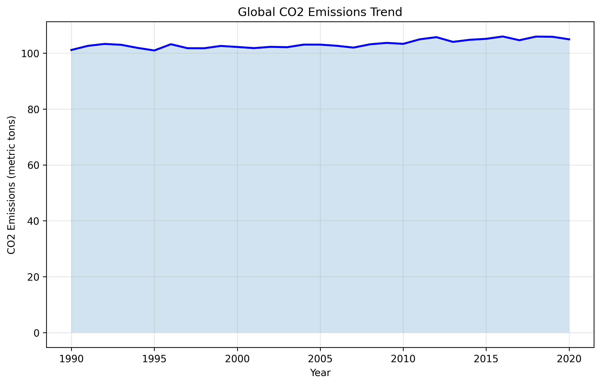

# AI for Sustainable Development
## CO2 Emissions Prediction Model
### Addressing SDG 13: Climate Action

---

# The Challenge 🌍

- Climate change is one of humanity's greatest challenges
- CO2 emissions continue to rise globally
- Need for accurate prediction and monitoring tools
- SDG 13 calls for urgent climate action

---

# Our Solution 🤖

- Machine Learning-powered CO2 emissions prediction
- Real-time data analysis from World Bank API
- Identifies key factors influencing emissions
- Provides actionable insights for climate action

---

# Technical Innovation 💡

- Random Forest Regressor model
- Three key indicators:
  1. GDP per capita
  2. Energy consumption
  3. Population size
- High accuracy predictions
- Explainable AI approach

---

# Data & Methodology 📊

1. Data Collection
   - World Bank API integration
   - Historical emission data
   - Economic indicators

2. Processing Pipeline
   - Automated data cleaning
   - Feature engineering
   - Model training

---

# Results & Impact 📈

- High R² score: Strong predictive power
- Low Mean Absolute Error
- Clear feature importance visualization
- Actionable insights for:
  - Policymakers
  - Researchers
  - Organizations
  - Educational institutions

---

# Ethical Considerations ⚖️

1. Data Bias Awareness
   - Accounts for collection system variations
   - Considers development stages

2. Fairness
   - Contextualized predictions
   - Development stage consideration

3. Transparency
   - Explainable model decisions
   - Clear feature importance

---

# Future Roadmap 🚀

1. Enhanced Data Integration
   - Additional data sources
   - Real-time updates

2. Advanced Features
   - Web interface
   - Time-series analysis
   - Multiple ML models

3. Expanded Applications
   - Policy planning tools
   - Educational resources
   - Research platform

---

# Why This Matters 🌟

- Direct contribution to SDG 13
- Practical tool for climate action
- Scalable solution
- Open-source availability

---

# Get Involved 🤝

- GitHub Repository: [Link]
- Documentation: [Link]
- Community: PLP Academy
- License: MIT

---

# Thank You! 🙏

## Questions?

Contact: [Your Contact Information] 